# EMBRAPA DATA API

- [EMBRAPA DATA API](#embrapa-data-api)
  - [Introdução](#introdução)
  - [Arquitetura da solução](#arquitetura-da-solução)
    - [Data Crawler](#data-crawler)
    - [Operation](#operation)
    - [Training](#training)

## Introdução

O presente software faz parte de uma solução de suporte à tomada de decisão da EMBRAPA, por meio da qual será possível aos Vinicultores terem acesso ao resultado de modelos de Machine Learning que irá prever demanda por produtos, tendência de importação e exportação, entre outros.

Serão utilizados dados fornecidos pela própria EMBRAPA, além de que serão conduzidos estudos para que haja definição de outros dados que serão utilizados como informações auxiliares para os modelos preditivos utilizados nesta solução.

## Arquitetura da solução

A solução deverá ser dividida em três camadas, conforme diagrama abaixo:

```mermaid
architecture-beta
  group ingestion [Data Crawler]
  group operation [Operation]
  group mlearning [Training]

  service embrapa(logos:chrome) [EMBRAPA] in ingestion
  service crawler(logos:python)[Crawler] in ingestion
  service dbucket(logos:aws-s3)[Data Bucket] in ingestion
  service queue(logos:aws-sqs)[SQS Queue] in ingestion

  crawler:T --> B:embrapa
  crawler:R --> L:dbucket
  dbucket:T  --> B:queue

  service enricher(logos:python) [Enricher] in operation
  service database(logos:postgresql) [PostgreSQL] in operation
  service restapi(logos:python) [REST API] in operation

  queue:R    --> L:enricher
  enricher:T --> R:dbucket
  enricher:R --> L:database
  restapi:T  --> B:database

  service mbucket(logos:aws-s3)[Model Bucket] in mlearning
  service mtraining(logos:python) [Model] in mlearning

  mtraining:T --> B:mbucket
  restapi:R   --> L:mbucket
  mtraining:L --> R:restapi
```

Mais detalhes de cada camada podem ser encontrados nas próximas sub-seções.

### Data Crawler

Esta camada será composta por um software Python que utilizará as bibliotecas [Scrapy](https://scrapy.org/) ou [Selenium](https://selenium-python.readthedocs.io/) que será responsável por obter os dados a serem trabalhados diretamente no site da EMBRAPA.

Este software será responsável por realizar acessos periódicos à EMBRAPA e obter tanto os arquivos CSV que eles disponibilizam quanto os dados expostos em HTML, sendo que salvará os primeiros de maneira bruta e estes segundos depois de formatá-los para também serem armazenados em arquivos CSV ou JSON. A razão pela qual haverá obtenção dos dois é algumas informações só estão disponíveis em um dos canais, como a categoria de um produto na seção Produto.

Visto que estes dados não representam um volume muito grande, eles serão armazenados em arquivos dentro de um Bucket de S3, que por sua vez será configurado para [notificar](https://docs.aws.amazon.com/AmazonS3/latest/userguide/EventNotifications.html) sempre que um novo arquivo estiver a disposição por meio de uma fila de Amazon SQS.

### Operation

Nesta camada contém um _code-base_ Python que usa arquitetura hexagonal e possui dois deployments específicos, um demoninado Enricher e outro REST API.

Enricher é um Worker (consumidor da fila SQS) responsável por processar as mensagens que são geradas sempre que uma ingestão de dados é concluída pelo Data Crawler, ou seja, sempre que ele obteve o último arquivo de cada categoria.

O Enricher, quando receber mensagens, basicamente verificará se ambos os arquivos de cada categoria estão disponíveis, e caso sim, irá cruzar as informações disponíveis neles e inserí-los em uma base de dados PostgreSQL.

A REST API, por sua vez, nada mais é do um outro deployment do mesmo software que expõe uma API REST (como seu nome sugere), por meio da qual os dados armazenados no PostgreSQL serão disponibilizados.

Futuramente, a REST API também irá disponibilizar o resultado das análises preditivas, por meio de modelos pré-treinados, conforme descrito na seção [Training](#training)

### Training

Este camada é consumidora da REST API e possui modelos de Machine Learning responsáveis por realizar análises preditivas utilizando os dados consumidos desta API.

Seu funcionamento é acionado sob demanda, e sempre que é executada, obtém dados disponíveis por meio da REST API, treina os modelos preditivos, e uma vez que os modelos estejam treinados, seu resultado é exportado para um arquivo [pickle](https://docs.python.org/3/library/pickle.html) que é versionado e enviado à um Bucket de S3.

A REST API, por sua vez, sempre que encontrar este arquivo irá carregá-lo e disponibilizar seus resultados por meio de outros endpoints desta API.
